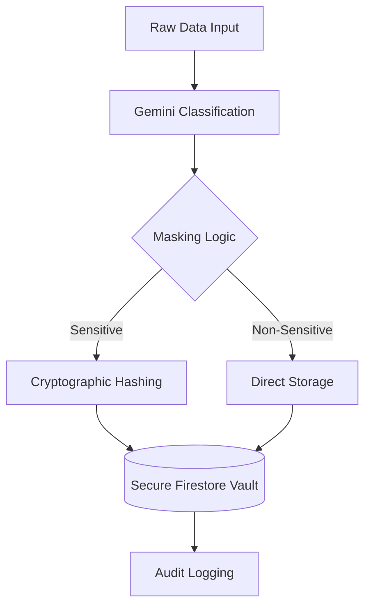

# Secure Batch Ingestion Gateway - Architecture

## Data Flow Overview

This system is designed around a **Zero-Trust Pipeline** where data is never stored in its raw form without explicit classification and masking.

### 1. Ingestion Stage
- **Input**: CSV or raw text via the React frontend.
- **Parsing**: Standard headers are detected, and UUIDs are generated for tracking.

### 2. AI Classification (Gemini 1.5 Flash)
- The raw data sample is sent to the Gemini API.
- The model identifies fields containing PII (SSN, CUSID, Addresses, etc.).
- A classification map is returned to the client to guide the masking logic.

### 3. Cryptographic Masking Engine
- **Hashing**: Sensitive fields are hashed using SHA-256 or SHA-512 with a unique user-provided salt.
- **Tokenization**: Non-reversible tokens are created for identifying records without exposing content.
- **Masking**: Display layers use character masking (e.g., `***-**-1234`).

### 4. Persistence Layer (Firebase)
- **Firestore**: Masked data and audit logs are stored.
- **Security Rules**: Attribute-Based Access Control (ABAC) ensures only authenticated owners can write, and reads are restricted to non-sensitive shards.

## Architecture Diagram (Mermaid)

